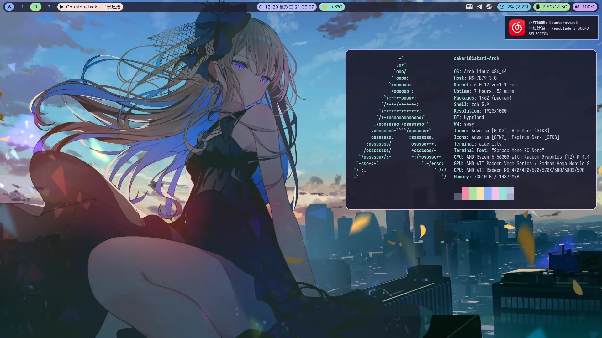

Dotfiles
===

Personal Archlinux dotfiles managed by [chezmoi](https://github.com/twpayne/chezmoi)

Themed by [Catppuccin Theme](https://github.com/catppuccin/catppuccin)

- hyprland
- waybar
- alacritty
- fontconfig
- mako
- wlogout
- rofi
- sway (reserved, switching to hyprland)
- swaylock
- mpv
- neovim
